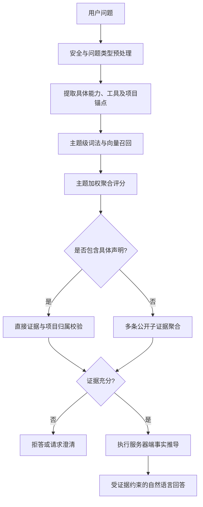

# RAG 主题聚合与事实推导设计

## 1. 背景与目标

当前个人网站 RAG 已经具备词法检索、向量检索和 RRF 加权融合。现有问题不是“没有做相似度加法”，而是系统仍以单条知识的排名和 top1-top2 差值作为主要回答门槛。对于“会哪些技能”“测试和工具”“介绍一下工作经验”这类宽泛问题，证据天然分散在多条知识中，单条知识竞争会导致合理问题被拒答，也会迫使维护者不断补充精确问法。

本次改造目标：

1. 将宽泛问题从“单条知识匹配”升级为“主题识别 + 多条公开证据聚合”。
2. 使用绝对主题得分和证据覆盖度决定是否回答，不要求宽泛问题通过 top1-top2 差值门槛。
3. 对具体技能、工具、框架和项目归属继续执行严格的直接证据校验，防止模型借助总览误答未知能力。
4. 加入服务器端“事实推导”层，对公开事实执行可验证的计算、归类、关联、对比和跨条目概括；从业跨度是第一项落地示例。
5. 用系统化问法变体和真实本地向量评测代替逐句打补丁。
6. 对新增的关键代码添加“做什么”和“为什么这样做”的注释，并在交付时列出所有修改路径。

不在本次范围内：修改生产环境、改变公开简历事实、宣称未公开的技能、以大模型自行推算日期，或通过全局降低相似度阈值提高召回。

## 2. 已确认的产品行为

### 2.1 宽泛问题

当用户询问一个可由公开资料概括的主题，例如“你会哪些测试工具”“介绍一下测试经验”“技术能力怎么样”，系统自动聚合多条相关公开证据，并在回答开头使用服务器控制的固定说明：

> 以下基于个人网站中的公开资料概括。

回答应是自然总结，不照搬知识条目，不机械罗列所有原文。

### 2.2 具体能力问题

当问题包含明确技能、工具、框架或平台实体，例如“Selenium”“Kubernetes”“禅道”，主题总览不能作为该实体的直接证据。只有公开知识中存在明确支持时才回答；否则继续返回“当前公开知识库中没有足够信息回答这个问题”。

### 2.3 工作经验与从业跨度

系统从公开工作经历中最早的月份 `2018-01` 计算到请求发生时的上海年月。以 `2026-08` 为例，从业跨度为 8 年 7 个月。

该数值表达为“从业跨度”或“公开经历覆盖的时间跨度”，不表达为“连续工作年限”，因为公开经历之间可能存在未说明的空档。回答同时概括造船/硬件、广告设备、边缘 AI 工控机和金融软件等经历，以及其中可确认的测试能力。

### 2.4 事实推导

事实推导不是仅用于计算工作年限的特殊逻辑，而是所有合适问题都可复用的受控处理层。系统可以基于公开资料：

- 计算时间跨度、阶段数量等确定性结果。
- 将项目、技能和工具归入知识库已定义的类别。
- 建立“技能/工具—公开经历—项目”的证据关联。
- 对多条经历做时间线整理、差异比较和共同能力概括。
- 将原始事实组织成自然结论，再使用来源条目解释结论依据。

系统不能借事实推导补全未公开经历、熟练度、成果数字、因果关系或主观评价。无法从公开证据复算或复核的内容不属于事实推导。

## 3. 总体架构

检索流程调整为：



现有 RRF 继续用于同一主题内的子知识排序。新增的主题层位于 RRF 之上，负责判断用户在询问哪个公开主题，以及该主题是否有足够的多条证据可回答。

## 4. 知识与索引结构

### 4.1 单一事实源

`knowledge/index.json` 继续作为公开知识的唯一事实源，新增两个结构：

1. `topics`：主题定义和其允许聚合的条目范围。
2. `employmentPeriods`：放在 `work-overview` 条目中，保存可计算的结构化起止月份。

主题定义建议包含：

```ts
interface KnowledgeTopic {
  id: string;
  title: string;
  description: string;
  category: "skill" | "tool" | "work" | "ai" | "project";
  entryIds: string[];
  lexicalAnchors: string[];
}
```

第一批主题为：

- 测试技能
- 工具与技术
- 工作经验
- AI 工作流
- 个人项目

`description` 用完整自然语言描述主题语义，供本地模型生成主题向量；`lexicalAnchors` 只存稳定主题词，不维护一份无限增长的完整问句别名表。

工作经历条目新增：

```ts
interface EmploymentPeriod {
  company: string;
  role: string;
  startMonth: string; // YYYY-MM
  endMonth: string | "present";
}
```

该结构只记录已经公开的简历事实，不从正文反向猜测日期。

### 4.2 生成索引

向量生成脚本同时生成：

- 条目向量：用于主题内证据排序。
- 主题向量：用于宽泛问题的主题识别。
- 知识版本、索引结构版本、向量模型标识和条目/主题数量：用于启动时一致性校验。

知识版本计划由 `1.2.1` 升为 `1.3.0`；向量索引结构升级为 v2。网站功能版本计划由 `0.2.3` 升为 `0.3.0`。最终版本号仍以实现时仓库现状为准。

## 5. 主题加权聚合

### 5.1 得分组成

每个候选主题计算一个 `[0, 1]` 的绝对聚合分数：

```text
主题聚合分 =
  45% × 主题语义相似度
+ 30% × 主题词法相关度
+ 15% × 子知识支持度
+ 10% × 有效证据覆盖度
```

各分量使用固定、可复现的归一化方式，不使用当次候选集合的 top1-top2 差值或动态 min-max 归一化：

- 主题语义相似度：问题向量与主题描述向量的余弦相似度，经固定校准函数映射到 `[0, 1]`。
- 主题词法相关度：稳定主题词、分词和 n-gram 的有界得分。
- 子知识支持度：该主题下 top-k 条目对问题的 RRF/语义支持，经有界函数归一化。
- 有效证据覆盖度：通过可见性、具体声明和项目归属校验的独立证据数量，达到 3 条后封顶。

上述 45/30/15/10 是设计初值。实现时只能通过真实评测集做小范围校准，并将最终数值固化在代码和文档中；不得为了让单个失败问句通过而临时下调全局门槛。

### 5.2 宽泛问题的接受条件

宽泛问题满足以下条件时可回答：

1. 识别到公开主题。
2. 主题聚合分达到固定绝对阈值。
3. 至少有两条有效公开证据，或存在一个内容完整且通过校验的主题总览条目。
4. 问题中没有未被直接证据支持的具体能力声明。

宽泛问题不再要求 top1-top2 margin。margin 只保留在无法稳定识别主题或仅有单条弱证据时，作为保守的二次判定，而不是主要召回方式。

### 5.3 具体声明优先门控

检索顺序必须先提取具体技能、工具、框架、平台和项目锚点，再决定是否允许主题聚合。这样可以防止“工具总览”覆盖未知工具，或把一个项目使用的工具错误归到另一个项目。

规则包括：

- 问“有哪些测试工具”属于宽泛主题，可聚合。
- 问“会不会 Selenium”包含具体实体，必须有直接证据。
- 问“养老金项目用了哪些工具”只能使用养老金项目范围内的条目。
- 问“银行客服平台技术栈是什么”不能混入个人网站或 AI 工作流条目。
- 同时出现已知与未知工具时，未知部分不能被已知部分掩盖。

主题聚合分不能绕过具体声明门控。

## 6. 事实推导

新增 `fact-derivation.ts`，负责执行有明确输入、输出和证据来源的推导规则。该模块不调用大模型；大模型只负责将已经生成的推导结果组织成自然语言，不能修改结果或引入新的事实。

### 6.1 允许的推导类型

每条推导规则必须加入明确白名单，并声明适用主题、输入字段、算法、输出结构、来源条目和失败行为。第一阶段支持：

- `duration`：根据结构化年月计算时间跨度。
- `count`：统计通过可见性和作用域校验的公开条目或类别数量。
- `group`：按知识库显式定义的行业、项目、技能或工具类别归组。
- `link`：建立技能/工具与明确提及它的公开经历之间的关联。
- `compare`：比较多个公开条目的显式字段或类别，不推断优劣和因果。
- `summarize`：从多条已通过校验的证据提取共同点、变化和能力覆盖范围。

其中 `duration`、`count`、`group` 和 `link` 由纯函数产生最终结果；`compare` 和 `summarize` 先由服务器生成结构化事实集合，再允许模型在严格证据约束下润色。模型生成的新主张如果不能映射回至少一条输入证据，则不得返回。

### 6.2 首个示例：从业跨度

计算规则：

1. 读取所有合法 `employmentPeriods.startMonth`。
2. 取最早公开起始月份。
3. 使用 `Asia/Shanghai` 当前年月；测试中通过依赖注入固定当前时间。
4. 月份差按起始月份到当前月份的自然经过时间计算；不把起始月重复计为一个完整月：

```text
elapsedMonths = (currentYear - startYear) × 12
              + (currentMonth - startMonth)
```

5. `years = floor(elapsedMonths / 12)`，`months = elapsedMonths % 12`。
6. 输出结构化结果，例如 `{ years: 8, months: 7, label: "8 年 7 个月" }`。

如果日期格式错误、未来日期、缺少起始月份或时区计算失败，则省略从业跨度，记录不含隐私和路径的安全诊断，并继续使用公开经历回答；禁止让模型自行估算或补全。

该推导结果继承 `work-overview` 的公开来源，不虚构新的知识来源。在提交给模型的受控上下文中单独标记为 `factDerivations`，并明确要求不得更改数值、不得改写为“连续工作”。

### 6.3 推导结果契约与可追溯性

每个推导结果使用统一结构：

```ts
interface FactDerivation {
  id: string;
  type: "duration" | "count" | "group" | "link" | "compare" | "summarize";
  topicId: string;
  value: unknown;
  statement: string;
  sourceEntryIds: string[];
  ruleVersion: string;
}
```

`statement` 是服务器生成的受控结论，`sourceEntryIds` 使每个结论都能追溯到公开知识，`ruleVersion` 用于规则升级后的回归验证。输入不足、来源冲突或结果无法验证时，该规则返回“不可推导”，回答层不得要求模型自行补全。

## 7. 回答生成约束

宽泛主题回答由服务端提供以下材料：

- 命中的主题标题。
- 通过校验的 top-k 子知识摘要。
- 可选的服务器端事实推导结果。
- 禁止表达和来源限制。

服务器保证在宽泛回答前添加固定前缀“以下基于个人网站中的公开资料概括。”，不依赖模型是否记得添加。

工作经验回答建议采用以下结构，但不固定为模板原文：

1. 说明公开经历的从业跨度。
2. 按阶段自然概括行业/产品变化，而非逐条复制简历。
3. 综合说明跨阶段形成的测试能力。
4. 如公开资料不足，明确边界，不推测未公开职责或精通程度。

回答仍返回实际证据条目的来源信息。主题本身和推导结果不伪装成新的简历来源。

## 8. 问法覆盖策略

不再为每个失败句子手工新增 alias。测试生成器基于以下维度构造确定性的问法矩阵：

- 人称：无主语、你、您、杨烨齐。
- 动作：有哪些、会什么、掌握什么、介绍、说说、概括。
- 主题：测试、测试能力、技能、工具、技术栈、工作经验。
- 语序：正常、主谓省略、倒装。
- 口语成分：平时、主要、都、一下。
- 标点和空格：有无问号、中文/英文空格。

生成器使用固定组合或固定种子，保证 CI 可复现。它验证主题级行为，不把生成出的每句话写回知识库。

负例库覆盖：

- 未公开工具、框架和平台。
- 已知工具 + 未知工具的组合。
- 具体项目 + 其他项目工具的跨项目拼接。
- 与个人公开经历无关的问题。
- 过程问法，避免被误判为能力声明。

## 9. 降级、可观测性与安全

### 9.1 本地向量不可用

如果本地 embedding 或主题向量索引不可用：

- 使用主题词法分和子知识支持度降级。
- 继续执行具体声明和项目归属门控。
- 只有达到降级模式的固定绝对阈值才回答。
- 健康检查和内部日志标识降级原因；前端不暴露模型路径、原始向量或堆栈。

### 9.2 索引不一致

知识版本、结构版本、模型标识、条目数量或主题数量不一致时，不使用过期向量索引；进入可诊断的词法降级模式，而不是静默混用。

### 9.3 检索轨迹

对前端可展示的轨迹只包含：命中主题、采用的检索模式、有效证据数量、是否应用事实推导、推导类型和拒答原因类别。内部日志可记录安全的阶段耗时、规则版本和错误名称，但不输出文件绝对路径、向量内容、提示词或私密环境变量。

## 10. 代码组织与注释规范

计划修改或新增的核心路径：

- `knowledge/index.json`：主题定义与结构化公开工作日期。
- `knowledge/vector-index.json`：由脚本重建的 v2 向量索引。
- `netlify/functions/_shared/topic-retrieval.ts`：主题召回、分数归一化与加权聚合。
- `netlify/functions/_shared/fact-derivation.ts`：白名单事实推导规则、统一结果契约与从业跨度计算。
- `netlify/functions/_shared/retrieval.ts`：具体声明/项目门控和主题内证据筛选。
- `netlify/functions/_shared/hybrid-retrieval.ts`：主题向量与现有混合检索的编排。
- `netlify/functions/_shared/ask-core.ts`：将主题、证据和事实推导结果传入回答层，并添加公开资料前缀。
- `scripts/generate-knowledge-vectors.mjs`：生成条目与主题向量。
- `scripts/evaluate-hybrid-retrieval.mjs`：加入主题召回、未知实体和跨项目评测。
- 对应的 `*.test.ts`、`README.md`、`knowledge/README.md`、`docs/OPERATIONS.md`、`CHANGELOG.md`、`VERSION` 和 `package.json`。

关键注释必须解释：

- 主题加权公式的各项服务什么目标，以及为什么不能用相对 margin 代替绝对判断。
- 为什么具体声明门控必须早于主题聚合。
- 为什么工作年限表达为“从业跨度”，以及月份经过时间的计算规则。
- 为什么每种事实推导必须使用白名单规则和来源映射，而不能交给模型自由推断。
- 为什么向量失败时仍不能跳过未知技能保护。

不对显而易见的赋值、循环或类型重复写注释，避免注释噪声。交付说明按实际修改结果提供可点击的绝对路径和各文件用途。

## 11. 测试与验收

### 11.1 单元测试

- 主题得分四个分量的边界、归一化和权重。
- 宽泛问题不依赖 margin，单条弱证据仍保守拒答。
- 具体未知实体在词法、完美伪造向量和真实本地向量下均拒答。
- 项目锚点隔离和已知/未知组合。
- embedding 失败与索引版本不一致的降级行为。
- 从业跨度的同月、跨年、月末、闰年、未来日期、非法日期和缺失日期。
- 各类事实推导的正确输入、证据追溯、来源冲突、输入不足和规则版本。
- 模型不能修改推导数值，也不能生成无法映射到输入证据的新主张。
- 固定前缀、来源和“不连续工作”表达限制。

### 11.2 系统化问法矩阵

至少覆盖测试技能、工具技术、工作经验、AI 工作流和个人项目五类主题。验收指标：

- 宽泛主题问法召回率不低于 95%。
- 未公开具体技能/工具的错误回答率为 0。
- 具体项目证据隔离正确率为 100%。
- 从业跨度边界与非法输入测试全部通过。

### 11.3 真实本地模型评测

在本地 BGE 模型和重建后的真实向量索引上执行评测，不以手写 semantic fixture 代替最终验收。保留当前细粒度问题的首条命中回归，同时新增宽泛主题、未知具体工具和跨项目反例。

### 11.4 完整验证顺序

1. 新增失败测试，确认旧实现无法满足新行为。
2. 实现最小主题聚合和事实推导逻辑。
3. 运行全部单元测试、类型检查和构建。
4. 重建向量索引并验证版本/数量一致。
5. 运行真实本地模型 RAG 评测。
6. 运行本地端到端问答验证。
7. 经用户单独授权后，才部署新的 Netlify Draft Preview；不部署生产环境。
8. Draft 冷态连续请求至少两次，验证主题回答、未知技能拒答、事实推导和健康状态。

## 12. 完成标准

只有同时满足以下条件才视为完成：

- 宽泛问题通过主题级多证据聚合回答，并带公开资料概括说明。
- 新问法不需要写入知识库 alias 才能得到同主题回答。
- 未公开具体能力和跨项目错误归属仍严格拒答。
- 工作经验回答包含服务器计算的正确从业跨度和自然综合概括。
- 其他合适问题可以复用事实推导层完成可验证的计算、归类、关联、对比或总结。
- 本地完整测试、真实向量评测、类型检查和构建全部通过。
- 代码中关键设计点具有说明“用途 + 原因”的注释。
- 文档、版本、索引和变更记录同步更新。
- 最终交付列出实际修改文件路径、各自用途和验证结果。
- 未经新的明确授权，不执行生产部署、git push 或发布。
